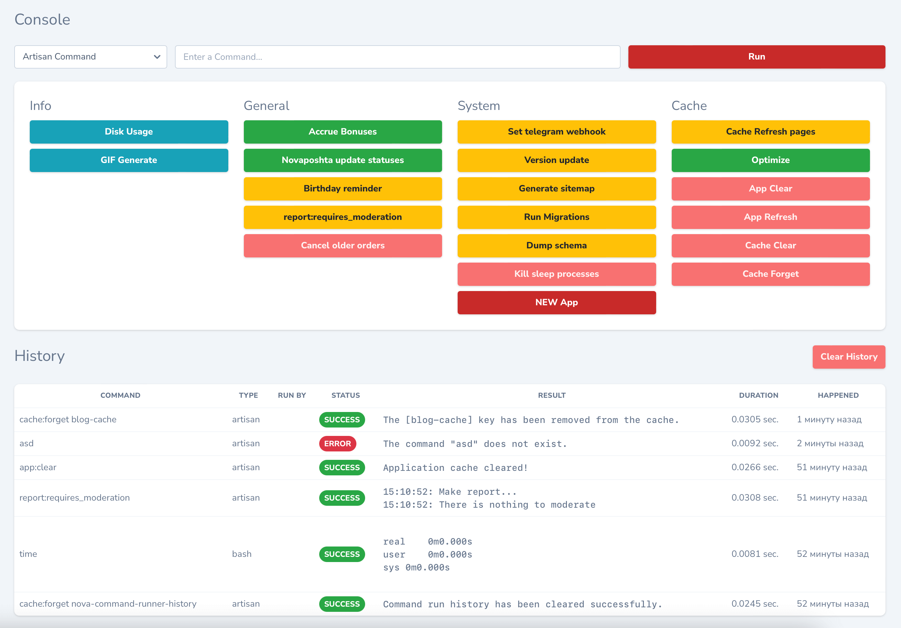
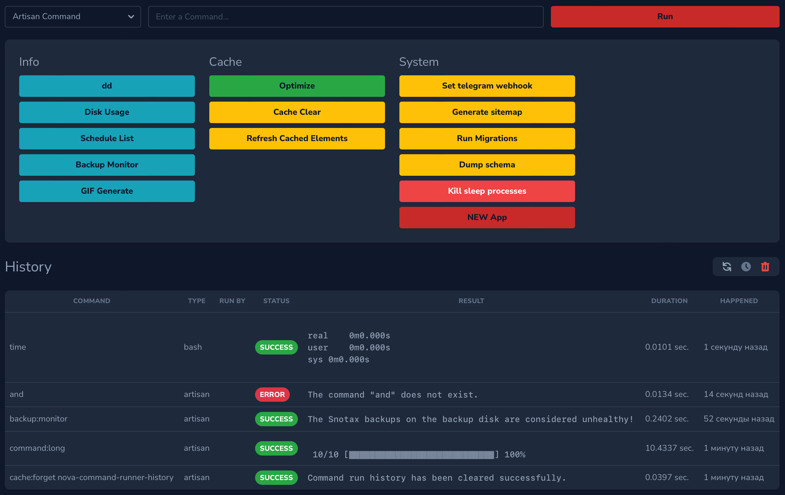
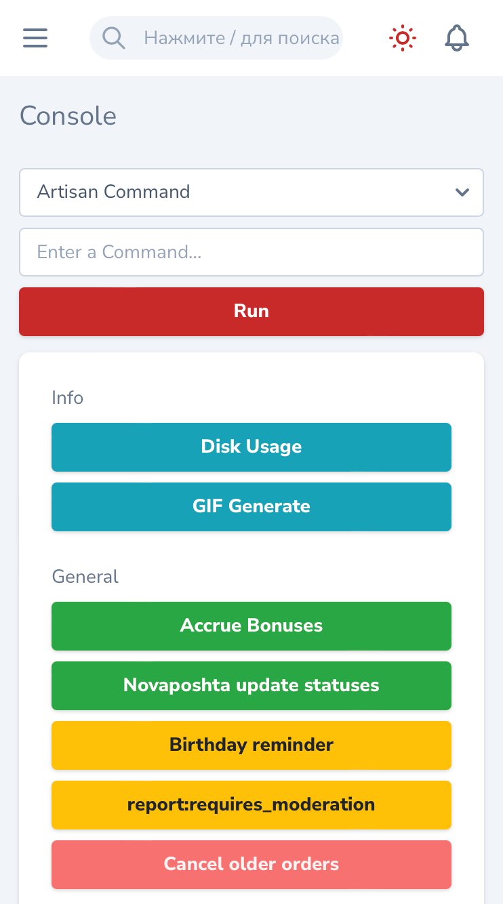
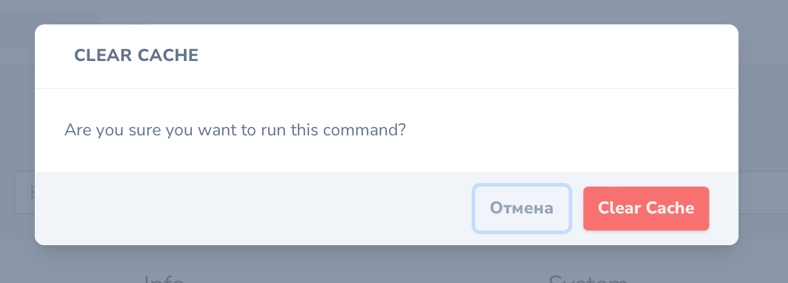
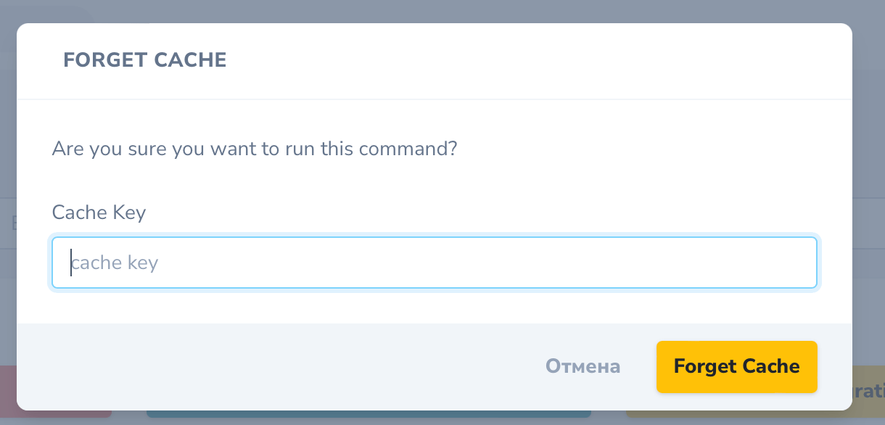
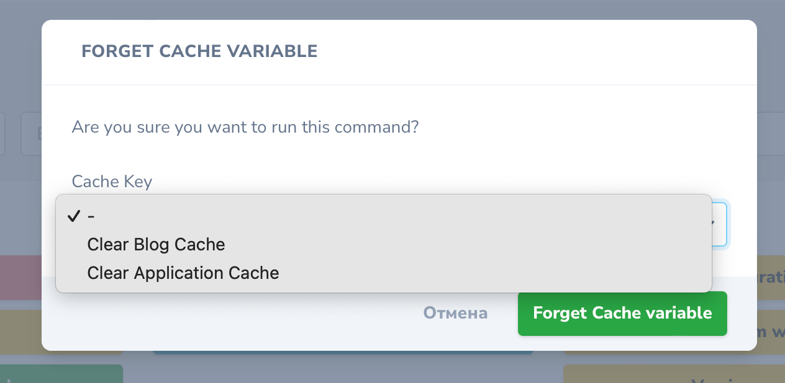
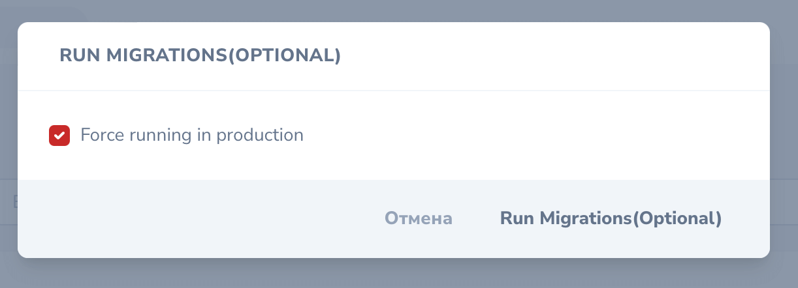

# Laravel Nova tool for running Artisan & Shell commands.

[](https://packagist.org/packages/stepanenko3/nova-command-runner)
[](https://packagist.org/packages/stepanenko3/nova-command-runner)
[](https://packagist.org/packages/stepanenko3/nova-command-runner)




## Description

This [Nova](https://nova.laravel.com) tool lets you run artisan and bash commands directly from nova.

> This is an extended version of the original package [Nova Command Runner](https://github.com/guratr/nova-command-runner) by [guratr](https://github.com/guratr)

## New in version 4.0

- Compatible with Nova 4.0
- Drop compability with Nova 3
- Dark mode compatibility
- Responsive
  
## Requirements

- `php: >=8.0`
- `laravel/nova: ^4.0`

## Features

- Run predefined artisan and shell commands
- Run custom artisan and shell commands
- Use variables while running commands
- Prompt the user to specify optional flags while running commands
- Use predefined values for variables using a select box or prompt the user to enter a value for the variable.
- Keep track of command run history
- No database changes required. Everything is managed from a single config file.
- Queue long running commands

## Installation

You can install the nova tool in to a Laravel app that uses [Nova](https://nova.laravel.com) via composer:

```bash
composer require stepanenko3/nova-command-runner
```

Next up, you must register the tool with Nova. This is typically done in the `tools` method of the `NovaServiceProvider`.

```php
// in app/Providers/NovaServiceProvder.php

// ...

public function tools()
{
    return [
        // ...
        new \Stepanenko3\NovaCommandRunner\CommandRunnerTool,
    ];
}
```

Publish the config file:

``` bash
php artisan vendor:publish --provider="Stepanenko3\NovaCommandRunner\ToolServiceProvider"
```

Add your commands to `config/nova-command-runner.php`

## Usage

Click on the `"Command Runner"` menu item in your Nova app to see the tool.

## Configuration

All the configuration is managed from a single configuration file located in `config/nova-command-runner.php`

### Adding Commands

All the commands which needs to be easily accessible should be defined in the `commands` array
in the configuration file.
#### Command Options

- run : command to run (E.g. route:cache)
- type : button class (primary, secondary, success, danger, warning, info, light, dark, link) 
- group: Group name (optional)
- variables : Array of variables used in the command(optional)
- command_type : Type of the command.(artisan or bash. Default artisan)
- flags : Array of optional flags for the command(optional)

#### Examples

```php
'commands' => [

    // Basic command
    'Clear Cache' => [
        'run' => 'cache:clear', 
        'type' => 'danger', 
        'group' => 'Cache',
    ],
     
    // Bash command
    'Disk Usage' => [
        'run' => 'df -h', 
        'type' => 'danger', 
        'group' => 'Statistics',
        'command_type' => 'bash'
    ],

    // Command with variable   
    'Clear Cache' => [
        'run' => 'cache:forget {cache key}', 
        'type' => 'danger', 
        'group' => 'Cache'
    ],

    // Command with advanced variable customization
    'Clear Cache' => [
        'run' => 'cache:forget {cache key}', 
        'type' => 'danger', 
        'group' => 'Cache',
        'variables' => [
            [
                'label' =>  'cache key' // This needs to match with variable defined in the command,
                'field' => 'select' // Allowed values (text,number,tel,select,date,email,password),
                'options' => [
                    'blog-cache' => 'Clear Blog Cache', 
                    'app-cache' => 'Clear Application Cache'
                ],
                'placeholder' => 'Select An Option'
            ]
        ]
    ],

    // Command with flags
    'Run Migrations' => [
        'run' => 'migrate --force', 
        'type' => 'danger', 
        'group' => 'Migration',
    ],

    // Command with optional flags
    'Run Migrations' => [
        'run' => 'migrate', 
        'type' => 'danger', 
        'group' => 'Migration',
        'flags' => [ 
            // These optional flags will be prompted as a checkbox for the user
            // And will be appended to the command if the user checks the checkbox

            '--force' => 'Force running in production' 
        ]
    ],

    // Command with help text
    'Run Migrations' => [
        'run' => 'migrate --force', 
        'type' => 'danger', 
        'group' => 'Migration',

        // You can also add html for help text.
        'help' => 'This is a destructive operation. Proceed only if you really know what you are doing.'
    ],

    // Queueing commands
    'Clear Cache' => [
        'run' => 'cache:clear --should-queue',
        'type' => 'danger',
        'group' => 'Cache',
    ],

    // Queueing commands on custom queue and connection
    'Clear Cache' => [
        'run' => 'cache:clear --should-queue --cr-queue=high --cr-connection=database',
        'type' => 'danger',
        'group' => 'Cache',
    ],
]
```

### Other Customizations

```php
// Limit the command run history to latest 10 runs
'history'  => 10,

// Tool name displayed in the navigation menu
'navigation_label' => 'Command Runner',

// Any additional info to display on the tool page. Can contain string and html.
'help' => '',

// Allow running of custom artisan and bash(shell) commands
'custom_commands' => ['artisan','bash'],

// Allow running of custom artisan commands only(disable custom bash(shell) commands)
'custom_commands' => ['artisan'],

// Allow running of custom bash(shell) commands only(disable custom artisan commands)
'custom_commands' => ['bash'],

// Disable running of custom commands.
'custom_commands' => [],
```

### Screenshots














## Credits

- [Artem Stepanenko](https://github.com/stepanenko3)
- [Srinath Reddy Dudi](https://github.com/srinathreddydudi)
- [guratr](https://github.com/guratr)

## Contributing

Thank you for considering contributing to this package! Please create a pull request with your contributions with detailed explanation of the changes you are proposing.

## License

This package is open-sourced software licensed under the [MIT license](LICENSE.md).
